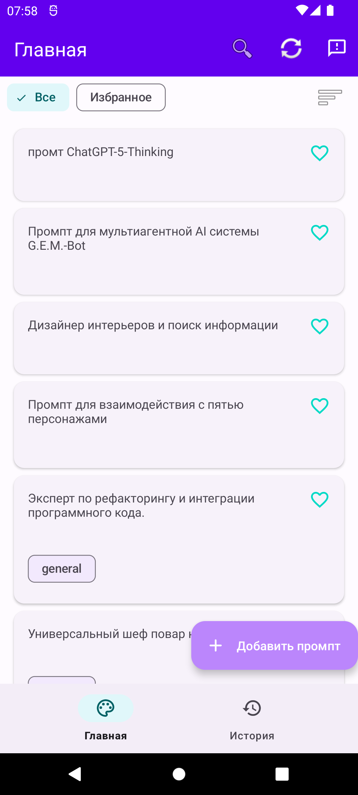
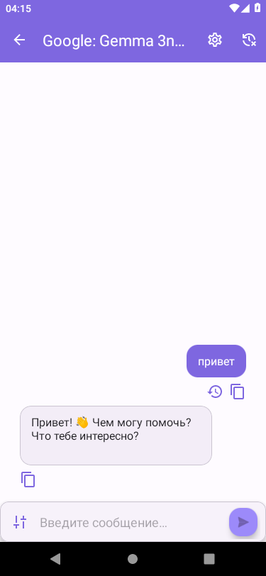

# AI Prompt Master

**Бесплатный инструмент с открытым исходным кодом для создания, улучшения и обмена промптами для AI.**

> Наша цель — дать сообществу мощный и удобный инструмент для работы с AI-моделями (такими как MidJourney, ChatGPT, Stable Diffusion), который будет развиваться благодаря идеям пользователей, а не за счет монетизации. **Бесплатно. Без рекламы. Навсегда.**

---

## 🚀 Ключевые функции

-   🔥 **Прямое общение с AI**: Интеграция с [OpenRouter API](https://openrouter.ai/) позволяет общаться с десятками различных LLM-моделей прямо из приложения. Поддерживается стриминг ответов для мгновенного получения результата.
-   🎨 **Гибкая настройка диалога**: Задайте "личность" для AI с помощью **системного промпта**, чтобы получать ответы в нужном стиле. Управляйте историей: очищайте, удаляйте или экспортируйте диалоги.
-   🔄 **Синхронизация с GitHub**: Храните свою личную коллекцию промптов в приватном репозитории GitHub, чтобы иметь к ней доступ с любого устройства. - `в разработке`
-   👥 **Общая библиотека промптов**: Получите доступ к постоянно растущей [открытой библиотеке промптов](https://github.com/arnyigor/aiprompts), созданной сообществом.
-   🔒 **100% Безопасность и приватность**: Все ваши данные, включая API-ключи и историю диалогов, хранятся локально на устройстве или в вашем личном репозитории GitHub. Никаких сторонних серверов или скрытой аналитики.

---

## 🗺️ План развития (Roadmap)

Мы видим большой потенциал для развития проекта. Вот наши ближайшие и долгосрочные цели:

#### 🎯 Ближайшие планы (Short-Term)
-   [x] **Динамические фильтры**: Реализована фильтрация и улучшенная сортировка на главном экране.
-   [x] **Управление диалогами**: Добавлена возможность задавать системный промпт, очищать и удалять чаты.
-   [ ] **Экспорт и "Поделиться"**: Возможность сохранить полную историю диалога в текстовый файл.
-   [ ] **Улучшение UI/UX**: Переход на Material 3, полировка анимаций и улучшение навигации.
-   [ ] **Локализация**: Перевод интерфейса на английский и другие языки.

#### 💡 В разработке и на очереди (Mid-Term)
-   [ ] **Поддержка планшетов**: Адаптация интерфейса для больших экранов и складных устройств.
-   [ ] **Расширенный конструктор промптов**: Добавление весов для слов, негативных промптов и более сложных структур.
-   [ ] **Теги и категории**: Улучшенная организация личной коллекции с помощью тегов и папок.
-   [ ] **Редактирование сообщений**: Возможность исправить или удалить отдельное сообщение в диалоге.

#### 🌟 Долгосрочные идеи (Long-Term)
-   [ ] **Система шаблонов**: Создание "умных" шаблонов, где нужно заполнить только несколько полей для генерации сложного промпта.
-   [ ] **История версий промпта**: Возможность отслеживать изменения в промпте и откатываться к предыдущим версиям.
-   [ ] **Внутренняя система сообщества**: Публикация, оценка и комментирование промптов внутри приложения.
-   [ ] **Опциональная облачная синхронизация**: Возможность синхронизации через другие сервисы (помимо GitHub).

---

<b>🛠️ Технологический стек</b>

 
Проект построен на современном стеке технологий для Android, что делает его быстрым, надежным и легким для поддержки:
<ul>
  <li><b>Язык</b>: 100% <a href="https://kotlinlang.org/">Kotlin</a></li>
  <li><b>Асинхронность</b>: <a href="https://kotlinlang.org/docs/coroutines-guide.html">Kotlin Coroutines</a> & <a href="https://kotlinlang.org/docs/flow.html">Flow</a></li>
  <li><b>Архитектура</b>: MVVM (Model-View-ViewModel) с элементами чистой архитектуры (слои Data, Domain, Presentation).</li>
  <li><b>UI</b>: Android Views с XML, Material Design Components.</li>
  <li><b>DI (Внедрение зависимостей)</b>: <a href="https://developer.android.com/training/dependency-injection/hilt-android">Dagger 2 / Hilt</a></li>
  <li><b>Сеть</b>: <a href="https://square.github.io/retrofit/">Retrofit</a> & <a href="https://square.github.io/okhttp/">OkHttp</a></li>
  <li><b>База данных</b>: <a href="https://developer.android.com/training/data-storage/room">Room</a> с поддержкой миграций.</li>
  <li><b>Навигация</b>: <a href="https://developer.android.com/guide/navigation">Jetpack Navigation Component</a></li>
</ul>

<b>📸 Скриншоты</b>

 
<table>
  <tr>
    <td align="center"><b>Главный экран</b></td>
    <td align="center"><b>Чат с ИИ</b></td>
  </tr>
  <tr>
    <td></td>
    <td></td>
  </tr>
  <tr>
    <td align="center"><i>Список промптов с поиском в реальном времени.</i></td>
    <td align="center"><i>Общение с ИИ моделями и стриминг ответов.</i></td>
  </tr>
</table>

---
## 📚 Библиотека промптов
Проект интегрирован с открытой библиотекой промптов: 📚 **[AI Prompts Repository](https://github.com/arnyigor/aiprompts)**.

Этот репозиторий содержит:
- Структурированную коллекцию промптов для различных AI-моделей.
- Готовые шаблоны для разных задач.
- Примеры эффективных запросов.
- Возможность внести свой вклад в развитие базы промптов.

---
## 📦 Установка
1.  Перейдите в раздел **[Releases](https://github.com/arnyigor/aipromptmaster/releases)**.
2.  Скачайте последний APK-файл.
3.  Разрешите установку из неизвестных источников в настройках вашего Android-устройства и установите приложение.
4.  Наслаждайтесь!

---
## 🙌 Как помочь проекту
Мы верим в силу сообщества! Любая помощь приветствуется.

-   ⭐ **Поставьте звезду**: Если вам нравится проект, поставьте ему звезду на GitHub!
-   🐞 **Сообщайте об ошибках**: Нашли баг? Создайте новый тикет в разделе **[Issues](https://github.com/arnyigor/aipromptmaster/issues)** или сразу в приложении через диалог обратной связи.
-   💡 **Предлагайте идеи**: Есть идея для новой функции? Расскажите о ней в **[Issues](https://github.com/arnyigor/aipromptmaster/issues)** или сразу в приложении через диалог обратной связи.
-   🧑‍💻 **Вносите свой код**: Хотите исправить баг или добавить новую фичу из Roadmap? Создавайте Pull Request! Мы всегда рады новым контрибьюторам.